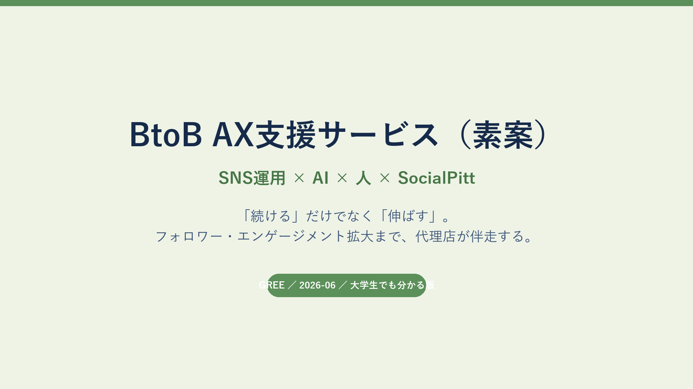
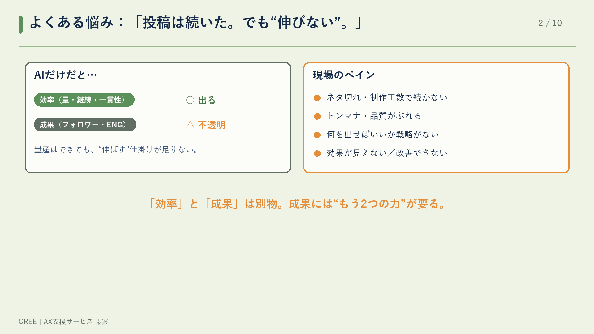
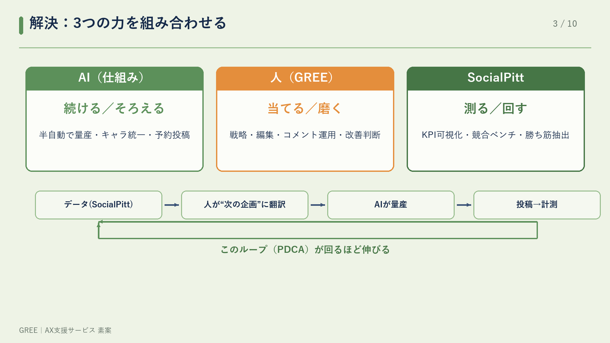
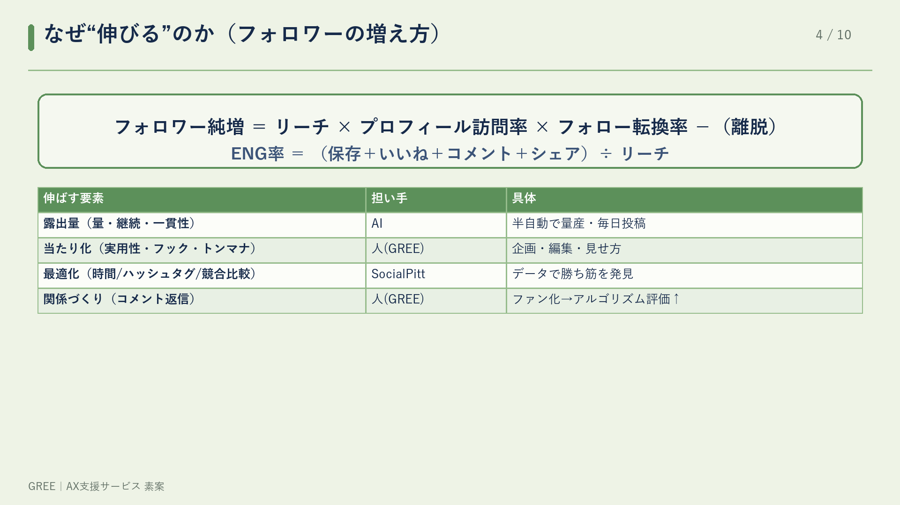
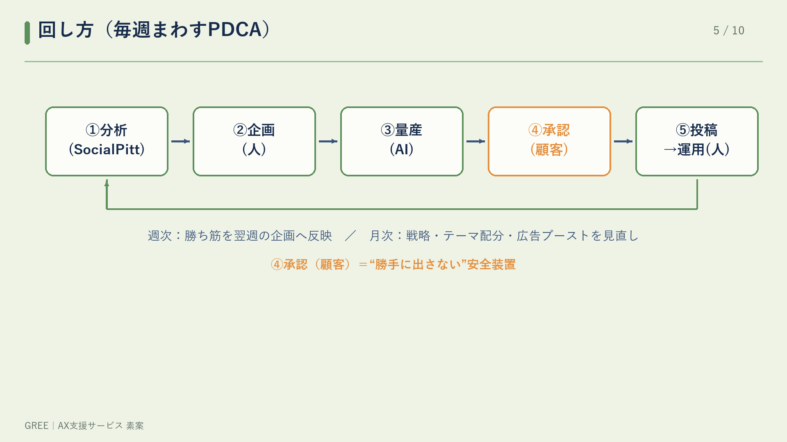
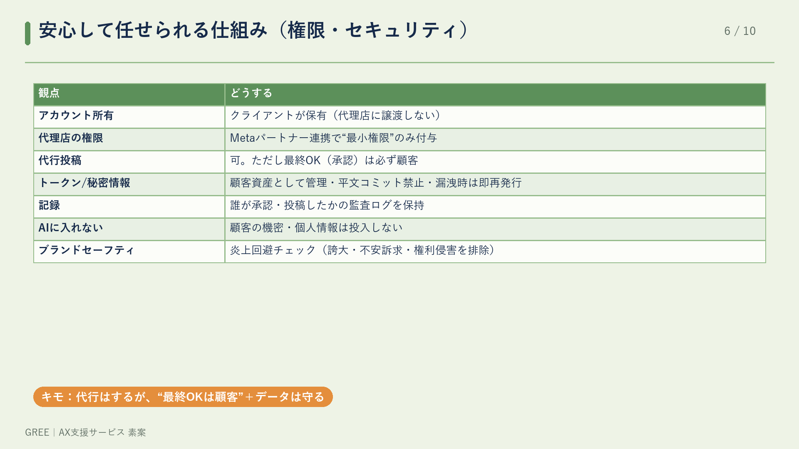
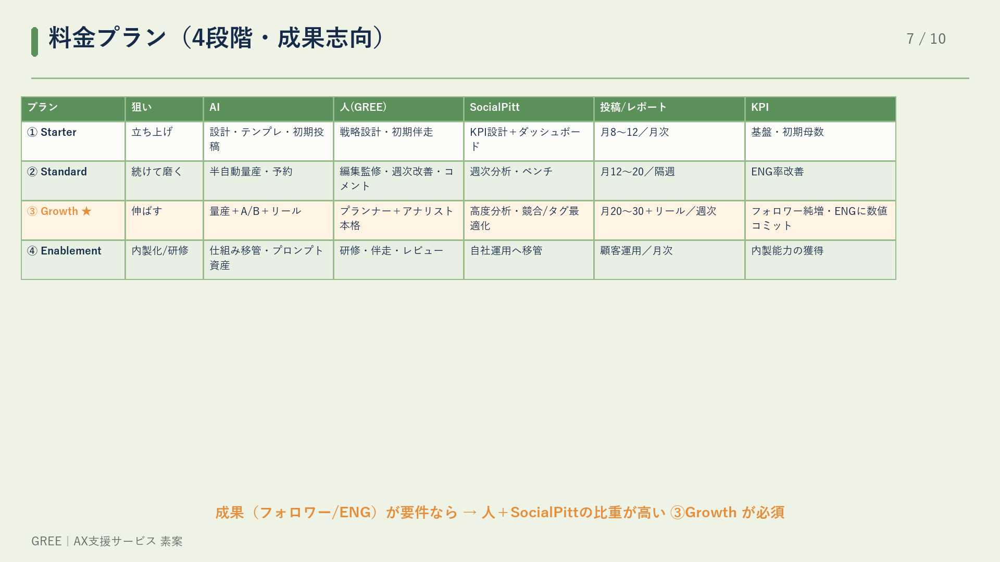
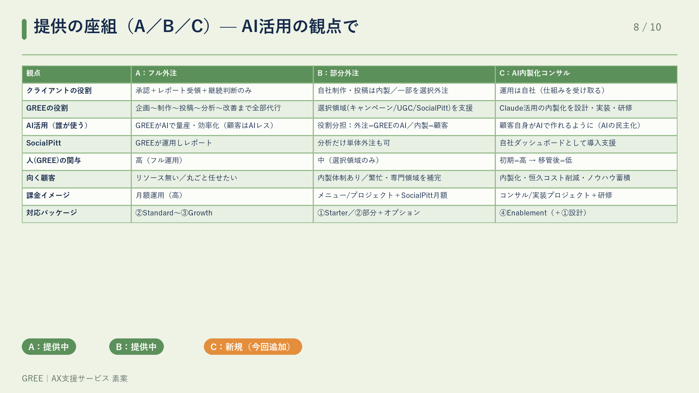
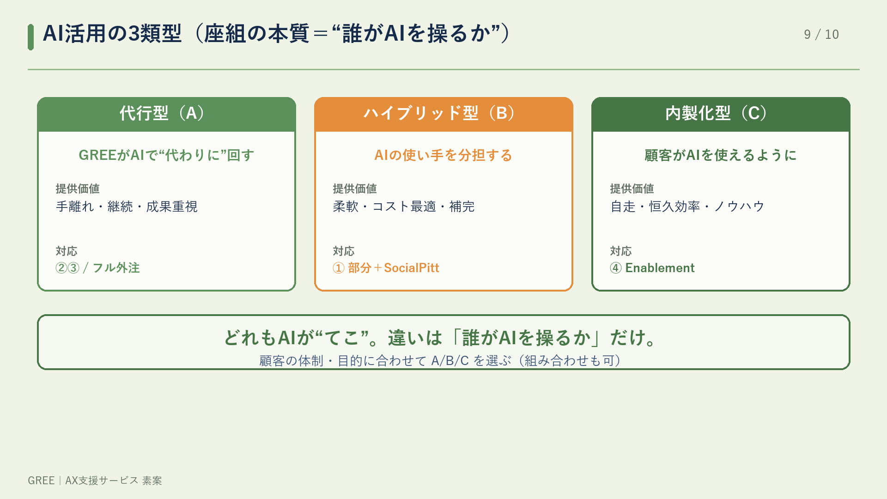
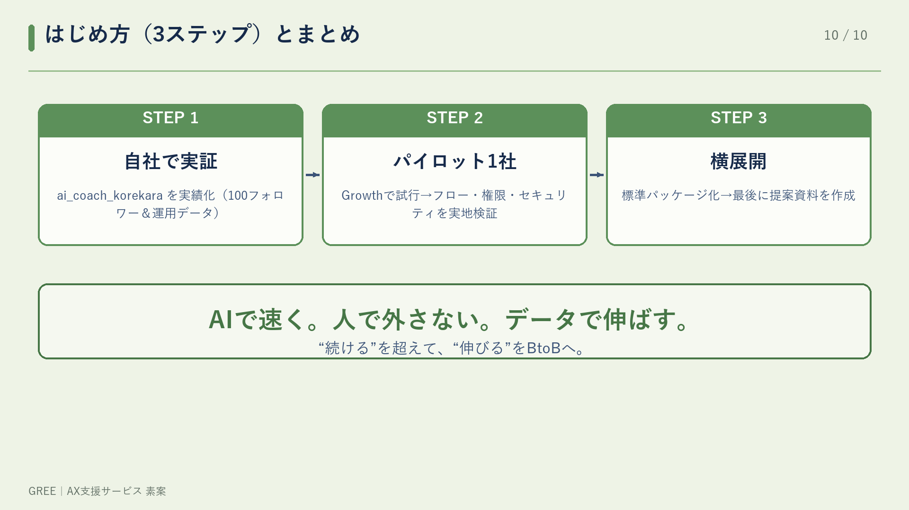

# AI駆動型SNS運用サービス_素案（GREE）— SNS運用 × AI × 人 × SocialPitt

「続ける」だけでなく「伸ばす」。フォロワー・エンゲージメント拡大まで、代理店が伴走するAX支援サービスの素案です。

- 📑 **PDF（10ページ）**: [AX支援サービス素案_GREE.pdf](./AX支援サービス素案_GREE.pdf)
- 🖼 編集可能スライド（pptx）: [AX支援サービス素案_GREE.pptx](./AX支援サービス素案_GREE.pptx)

---

## スライド（全10枚）

### 1. 表紙

### 2. 課題（効率 ≠ 成果）

### 3. 解決：3レイヤー・エンジン（AI × 人 × SocialPitt）

### 4. なぜ伸びるのか（KPIツリー）

### 5. 回し方（週次PDCA）

### 6. 権限・セキュリティ

### 7. 料金プラン（4段階）

### 8. 提供の座組（A/B/C）

### 9. AI活用の3類型

### 10. 導入ステップ＋まとめ

